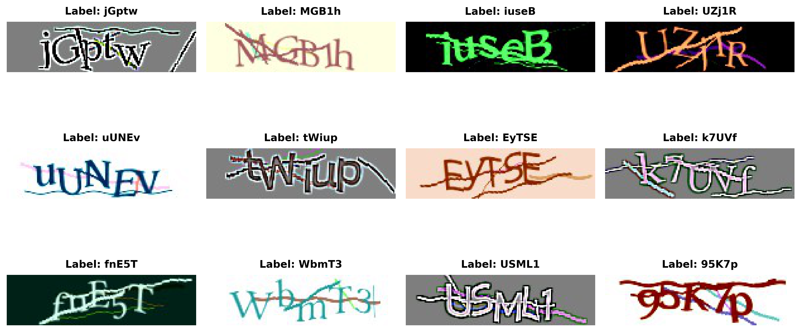
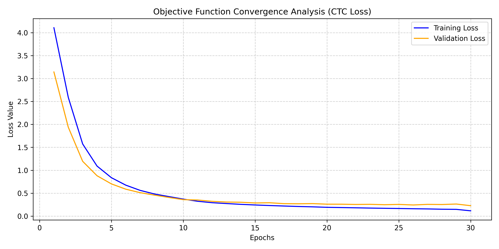
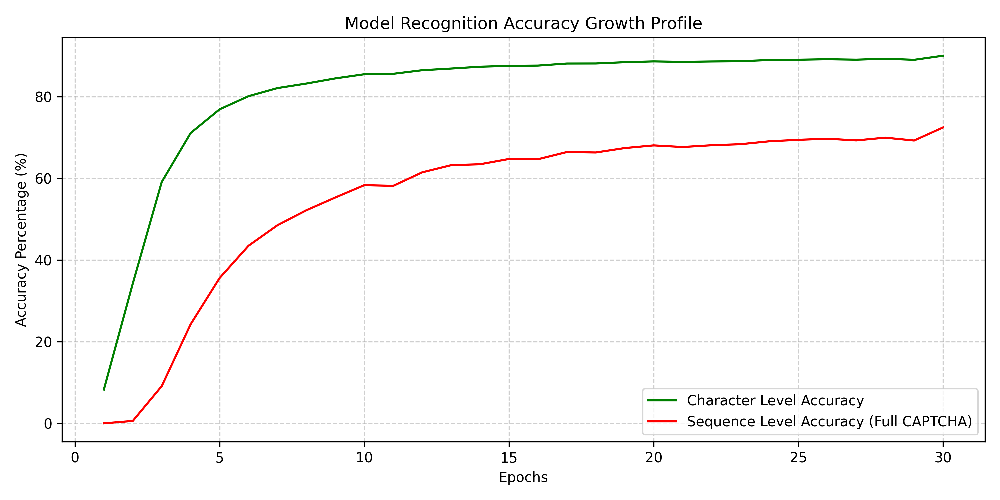
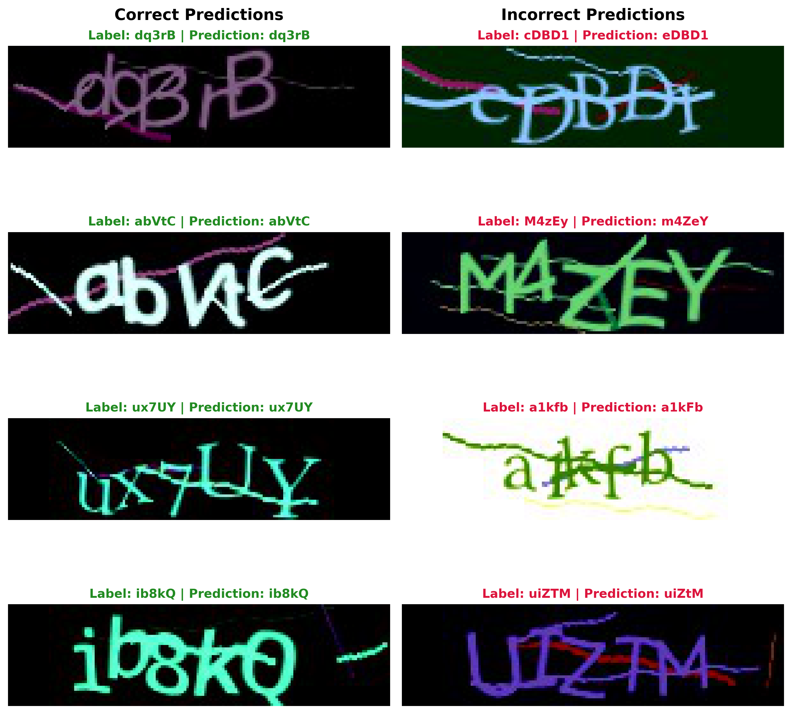

# CAPTCHA Sequence Recognition using CRNN

An end-to-end deep learning pipeline for alphanumeric CAPTCHA sequence recognition without prior character segmentation. The model architecture utilizes a modified ResNet-18 as a visual feature extractor, coupled with a Bidirectional LSTM for sequence modeling, and is trained using Connectionist Temporal Classification (CTC) Loss.

---

## Architecture Details

To successfully align the target sequence with visual features using CTC Loss, the receptive field and sequence length of the feature map must be carefully managed. 
* **Feature Extractor (CNN):** A modified **ResNet-18**. The standard stride of `(2, 2)` in layers 3 and 4 was reduced to `(2, 1)`. This prevents aggressive downsampling of the width dimension, preserving a sequence length of 19 time steps.
* **Sequence Modeler (RNN):** Two layers of **Bidirectional LSTM (Bi-LSTM)** with a hidden size of 256. This allows the model to leverage both left-to-right and right-to-left spatial context to resolve character overlapping.
* **Objective Function:** **CTC Loss** with a blank token alignment, enabling end-to-end training without localized character bounding box annotations.

---

## Dataset

The model is trained and evaluated on the **Alphanumeric CAPTCHA Dataset** available on Kaggle. 

* **Source:** [Kaggle - Alphanumeric CAPTCHA Dataset](https://www.kaggle.com/datasets/parsasam/captcha-dataset/data)
* **Volume:** 130,063 images
* **Resolution:** 150x40 pixels (RGB)
* **Format:** 5-character alphanumeric strings containing digits, lowercase, and uppercase letters
* **Challenges:** Random rotation, scaling, Gaussian noise, intersecting background lines, and overlapping characters (crowding effect).

### Raw Dataset Samples

---

## Performance & Evaluation

The model was evaluated on an isolated test set consisting of 13,007 images (10% split of the original dataset). 

Due to the nature of CAPTCHA recognition, even a single character mismatch invalidates the entire sequence. Therefore, performance is tracked using two distinct metrics:
* **Character Accuracy:** **90.03%** (ratio of correctly predicted individual characters).
* **Sequence Accuracy (Full CAPTCHA):** **72.46%** (ratio of fully recognized 5-character sequences).

### Training Metrics & Convergence

The charts below illustrate the training progress over 30 epochs:

|        Loss Convergence (CTC Loss)         |            Accuracy Growth Profile            |
|:------------------------------------------:|:---------------------------------------------:|
|  |  |

---

## Qualitative Analysis & Error Discussion

To better understand the model's behavior, predictions were analyzed on a sample level. This step is crucial for identifying structural limitations in the dataset and the recognition pipeline.

The visualization below presents a selection of correct predictions alongside typical misclassifications generated by the model:

### Key Findings from Error Analysis

1. **Visual Similarity (Ambiguity):**
   The lowest F1-scores were observed for characters like `1`, `I`, `i`, and `j`. These characters are highly susceptible to noise. For example, the dot in `i` or `j` can easily merge with background salt-and-pepper noise or be cut by intersecting lines, leading to misclassification.

2. **Deformation and Intersections:**
   Highly distorted or rotated characters (e.g., `e`, `r`, `n`, `t`, `c`) occasionally alter their local features to the point where they resemble other classes. For instance, a diagonal noise line intersecting the letter `c` can visually bridge the gap, causing the model to predict `e`.

3. **Character Crowding & Segmentation:**
   Due to the crowding effect, adjacent characters often overlap. While the CRNN (Bi-LSTM) architecture successfully leverages contextual features to resolve most of these overlaps without explicit segmentation, extreme crowding remains a primary source of localized sequence errors.